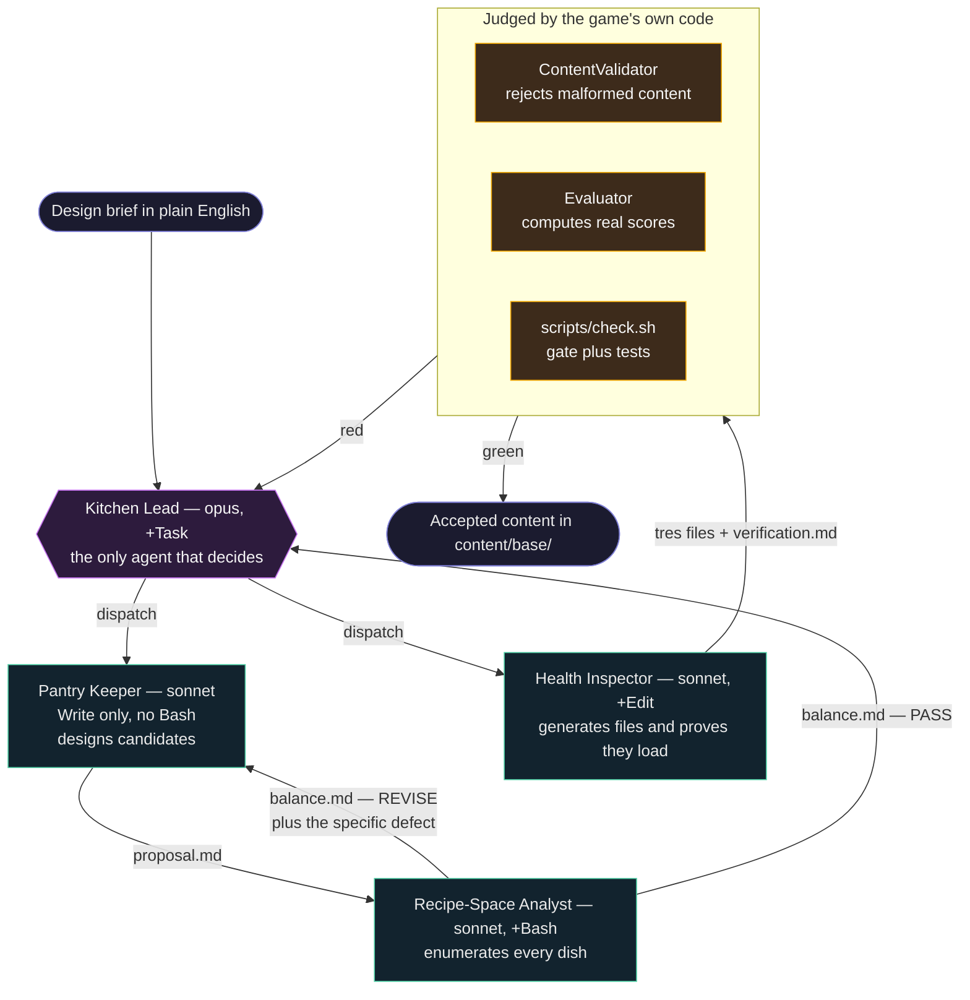

# The Neon Kitchen content crew

A four-agent crew, orchestrated by Claude Code, that turns a plain-English design
brief into **validated, shippable game content** for *Neon Kitchen*.

*Neon Kitchen* is a Godot 4.7.1 recipe-composition puzzle game. The player
combines up to three ingredients into a dish and serves it to a customer who has
a hidden flavour preference; the dish is scored against that preference and the
customer reacts. Content — the ingredients and the customers — is therefore not
decoration. It **is** the puzzle. A badly balanced ingredient does not look wrong,
it makes a day of the game trivially easy or unsolvable, and you find out by
playing it.

That is the problem this crew exists to solve.

## What it produces

Input: one sentence, of the kind a designer actually says out loud.

> A late-shift medic who wants something fresh and light, nothing heavy. Add
> whatever single ingredient makes that request solvable against the existing
> pantry.

Output: typed Godot `.tres` resources in `content/base/`, plus localisation rows,
that load through the game's real repository, pass the game's real validator, and
score through the game's real evaluator.

## The crew



Two edges in that diagram carry the whole design.

The **`REVISE` → Pantry Keeper** edge is what makes this a crew rather than a
pipeline. The Analyst cannot fix what it finds — it reports the defect and the
designer role fixes it. If the Analyst could adjust the numbers, the check and the
thing being checked would be the same agent, and the check would be worth nothing.

The **`red` → Kitchen Lead** edge is where a rejected run goes. The game's own
code is the judge, and it answers to no agent's report.

## Why each role is load-bearing

Roles are enforced by **tool grants in each definition's frontmatter**, not by
asking politely in prose. An agent that lacks `Bash` cannot run the evaluator no
matter how much it would like to.

| Agent | Grant | What the grant makes impossible |
|---|---|---|
| `kitchen-lead` | `+ Task` | It is the **only** agent that can spawn another, so no specialist can quietly recruit help or subcontract its own judgement. |
| `pantry-keeper` | `Write`, **no `Bash`** | It cannot run the evaluator, so it cannot pre-compute the scores the Analyst is there to check. Its proposal is a genuine hypothesis. |
| `recipe-space-analyst` | `+ Bash`, no `Edit` | It can compute but not author. It reports `REVISE` with a reason; it cannot rebalance the thing it just judged. |
| `health-inspector` | `+ Edit`, no authority over numbers | It generates files and proves they load. It may report that a value will not validate; it may not change that value to make its own report green. |

Remove any one of them and something real is lost: without the Pantry Keeper
nothing proposes, without the Analyst nothing catches an unsolvable customer,
without the Health Inspector nothing turns a proposal into a file the engine can
load, and without the Kitchen Lead nothing decides between two specialists who
disagree.

## The game connection

The crew's output is not judged by a human reading plausible-looking numbers. It
is judged by the shipped game:

- **`ContentValidator`** rejects malformed identifiers, out-of-range flavour
  values, and vacuous constraints — a `FORBID_TAG` naming a tag no ingredient
  carries fails the whole content set.
- **`Evaluator`** computes the real score and band, with the integer-only
  arithmetic specified in [ADR 0004](../adr/0004-phase-1-contracts.md) §3.
- **`scripts/check.sh`** is the project gate CI runs: engine version, formatting,
  linting, warnings-as-errors, domain purity, dependency direction, and the tests.

So "the crew succeeded" is a claim the repository can falsify. `tools/run_crew.sh`
re-runs the gate itself after the crew finishes, precisely so the run is scored by
the project's criterion instead of by an agent's report of it.

## Running it

**Live, interactive** — the demo to watch:

```
/crew A late-shift medic who wants something fresh and light, nothing heavy.
```

**Headless and reproducible** — the demo to trust:

```bash
./tools/run_crew.sh "A late-shift medic who wants something fresh and light."
```

The script refuses to start on a dirty working tree. It bypasses permission
prompts, because a non-interactive run cannot answer one, and the dirty-tree guard
is what makes that recoverable: anything the crew writes comes back with
`git checkout . && git clean -fd`. Each specialist is still confined to its own
`tools:` grant.

Transcripts land in `docs/worklogs/crew-runs/latest.md`.

### One thing that will bite you

Claude Code discovers `.claude/agents/*.md` **at process start**. A session that
was already running when those files were written cannot dispatch them, and fails
with `Agent type 'pantry-keeper' not found`. Reload, or use the script — it starts
a fresh process for exactly this reason.

## Files

| Path | What it is |
|---|---|
| `.claude/agents/*.md` | the four agent definitions; frontmatter grants are the enforcement |
| `.claude/commands/crew.md` | the `/crew` slash command |
| `tools/run_crew.sh` | headless runner, re-runs the gate afterwards |
| `content/staging/` | the artifacts agents hand to each other |
| `docs/worklogs/crew-runs/` | recorded runs |

## Design intent, for the curious

The crew mirrors the studio structure the game's own design document already
declares in §4.1 — Kitchen Lead, Pantry Keeper, Recipe-Space Analyst, Health
Inspector. The names were not invented for this assignment. That matters more than
it sounds: the agents implement an architecture the project had already committed
to on paper, so the crew is the capstone's own team, automated.

The discipline they are held to comes from the project's scar tissue. Five review
rounds produced defects of almost entirely one shape: **the code was defensible
and the claim about it was false.** A port promising sorted output while sorting by
interned pointer. A test named for a bug it could not catch. A composer documented
as asserting its own output while leaning entirely on the value object beneath it —
deleting its clamp left all 95 tests green.

Hence the rule every agent definition repeats, and the reason the Kitchen Lead
verifies independently rather than reading reports: **a `PASS` with no pasted
output is an unverified claim.**
