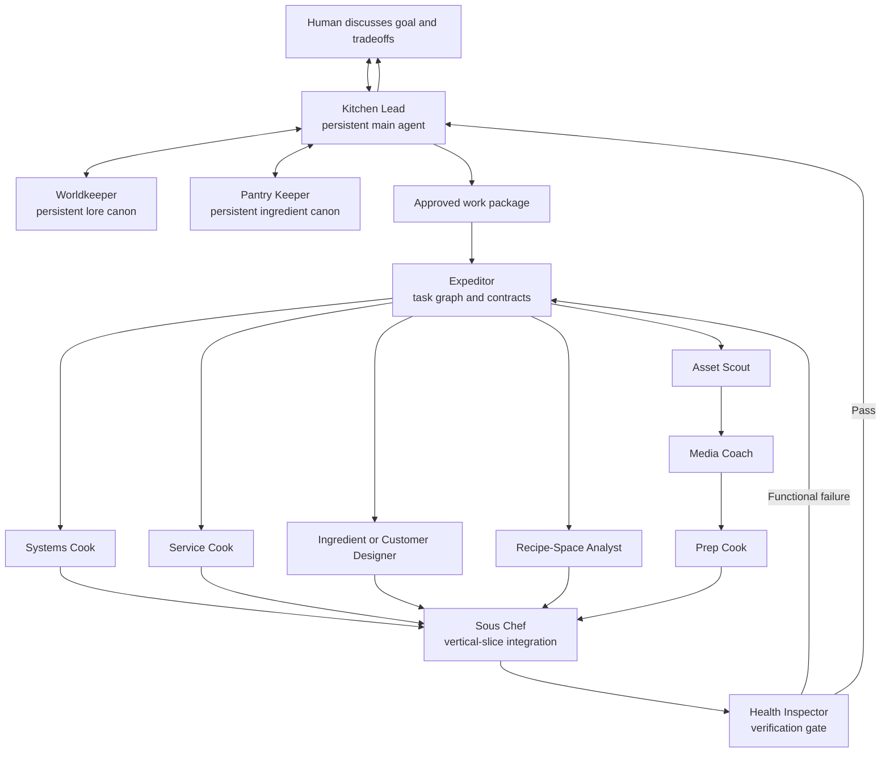

# Neon Kitchen: Game Design Document: Capstone

# 1\. Executive Summary

## The Game

*Neon Kitchen* is a recipe-composition puzzle set inside a nomad food truck in a cyberpunk city. Customers do not order exact menu items. They describe what they want through qualities such as comforting, spicy, fresh, savory, or adventurous, and may add a dietary or ingredient constraint.

The player reviews a fully visible pantry, combines one to three ingredients, and serves the result. Each ingredient has consistent flavor values and culinary tags. The customer evaluates the finished dish against their preferences and explains what worked, what missed, and whether the recipe respected their constraint.

Development begins with a Phase 1 terminal prototype containing twelve ingredients, five flavor dimensions, and eight customer encounters. This is a temporary rules-testing surface, not the capstone deliverable. It intentionally excludes graphics, inventory depletion, economy, progression, and cooking minigames so it can answer one question:

> **Is creating recipes for customers an enjoyable puzzle?**

The capstone deliverable is a playable Godot 4.x desktop game with a functional food-truck UI implementing the validated recipe-composition loop. Phase 1 data, rules, tests, and customer content move into that build through a defined migration pipeline rather than being rewritten from scratch. A larger post-capstone game could add ingredient purchasing, limited stock, recipe discoveries, customer relationships, cooking techniques, and story progression.

## The Core Loop

Read a customer request → inspect the full pantry → select one to three ingredients → review the proposed dish → serve → receive a score and specific feedback → apply what was learned to the next customer.

## Win and Loss Conditions

The Phase 1 prototype has no early loss state. The player meets all eight customers and reaches a session summary regardless of individual results. A disappointing dish is information rather than a run-ending punishment.

Dish results use four rating bands:

* **Delighted:** 85–100
* **Satisfied:** 65–84
* **Mixed:** 40–64
* **Dissatisfied:** 0–39

A hard dietary, allergen, required-ingredient, or forbidden-ingredient violation caps the score at 39. This prevents a strong flavor match from overriding an explicit customer boundary.

The prototype succeeds as a design experiment when players can explain their results, find more than one plausible solution, and express curiosity about trying another combination. There is no profit-based victory condition in Phase 1.

## Three Game Design Pillars

1. **Creative Expression Through Constrained Composition:** The player combines a small set of expressive ingredients to make a personal solution. Most customers should have at least three meaningfully different satisfying recipes instead of one predetermined answer.

2. **Customer Matching and Legible Learning:** Every dish is made for someone. Customer dialogue communicates a desire, explicit constraints prevent guesswork, and feedback teaches the player how the system interpreted the recipe.

3. **Community Within a Hostile City:** The larger game contrasts a harsh cyberpunk environment with care, improvisation, and community-scale solarpunk. Phase 1 expresses this primarily through customer voice and ingredient descriptions rather than a separate narrative system.

The game may look cute and inviting, but it is not automatically cozy. Food is personal, and the tension comes from interpreting a person correctly while balancing competing needs. Phase 1 creates this pressure through flavor conflicts and food constraints instead of a timer.

## Comparisons

* **Potion Craft:** Experimentation, systemic discovery, and learning how components behave.

* **Good Pizza, Great Pizza:** Interpreting customer language and serving people rather than completing abstract recipes.

* **Stacklands:** Ingredients as compact, readable pieces that combine into larger outcomes, without adopting random card draws.

* **VA-11 Hall-A:** Intimate service work and character framing within a neon city.

Traditional deckbuilding is an inspiration for synergy, buildcraft, and long-term planning, but not for random hands. If an ingredient is stocked, the player should be able to use it.

## Art Direction

The capstone Godot game uses a scoped 2D interface with pixel-art cyberpunk and community-scale solarpunk influences. The city is dark, industrial, and illuminated by corporate neon. The food truck uses warm lighting, repaired technology, reclaimed materials, exposed cables, solar panels, hand-painted signs, and small planters.

Phase 1 requires no art, animation, music, or sound. Its terminal presentation needs readable spacing, consistent commands, numbered pantry choices, clear serving confirmation, concise reactions, and optional color that is never the only carrier of meaning. The later Godot build translates those same information priorities into a customer request panel, visible ingredient choices, a proposed-dish area, a Serve action, and a feedback panel.

In the larger game, ingredients and recipes can communicate neighborhoods, migration, family traditions, trade, scarcity, and relationships. Unlocking an ingredient should feel like learning about the world rather than simply receiving a stronger stat block.

## Stretch Goals

After the Phase 1 rules gate and the baseline Godot UI are complete, a later prototype may test one additional pressure system:

* limited pantry stock across a service;
* ingredient purchasing and budget;
* recipe discovery and recall;
* customer relationships and narrative consequences; or
* cooking techniques that transform flavor.

Only one of these should be added to the next prototype. Economy, inventory, timing, progression, procedural recipe names, travel, farming, cleaning, combat, hacking, staff management, branching campaigns, multiplayer, high-volume custom animation, and an original soundtrack are deferred. A functional Godot UI is required capstone scope, not a stretch goal.

# 2\. Game Mechanics

## 2.1 Player Actions

| Verb | Input | What the player sees | Decision enabled |
| :---- | :---- | :---- | :---- |
| Read request | Read text | Customer dialogue, emphasized preferences, and explicit constraint text | Which needs matter most |
| Inspect ingredient | Enter a list or help command | Flavor description plus culinary, dietary, and allergen tags | What each ingredient contributes |
| Add ingredient | Enter an ingredient number or name | Proposed dish and ingredient count update | Which qualities and constraints to combine |
| Remove ingredient | Enter a remove or back command | Proposed dish updates without penalty | How to revise before committing |
| Serve | Confirm the dish | Customer reacts to the exact combination | Whether the interpretation worked |
| Review feedback | Read result | Rating, constraint result, strongest match, and largest miss | What to learn for later customers |

## 2.2 Moment-to-Moment Play

A night courier says:

> “I need something comforting with enough spice to wake me up. Nothing fermented tonight—my stomach is already arguing with me.”

The player inspects the pantry. Noodles contribute strongly to Comfort. Pepper paste contributes Spicy and Savory, but it is tagged **Fermented**. The most obvious spicy ingredient therefore conflicts with the customer’s boundary.

The player combines **noodles, mushrooms, and chili crisp**. The dish is comforting, savory, and spicy without using a fermented ingredient. After serving, the player sees:

* **Satisfied — 78**
* **Constraint met:** no fermented ingredients
* **Strongest match:** Comfort
* **Largest miss:** Spicy was slightly lower than requested
* “Warm, filling, and just enough to get me through the rain.”

The player learns why the recipe worked, what could improve, and how the constraint changed the solution. The result is never presented as an unexplained internal calculation.

## 2.3 Systems as the Player Meets Them

| System | What the player experiences and learns | Key values |
| :---- | :---- | :---- |
| Pantry | The complete pantry is visible for every customer. Ingredients are not randomly drawn or consumed between encounters. | Twelve ingredients |
| Recipe composition | The player freely adds or removes ingredients before serving. Ingredient order has no effect, duplicates are not allowed, and more ingredients are not always better. | One to three distinct ingredients |
| Flavor | Ingredients contribute consistent values in Savory, Spicy, Fresh, Comfort, and Adventurous. Dish values are added and capped at five. | Ingredient values 0–3; dish values 0–5 |
| Ingredient metadata | Culinary, dietary, and allergen tags support constraints without being mixed into flavor values. | Examples: protein, vegetable, fermented, vegan, soy, gluten |
| Customers | Requests use natural dialogue backed by weighted flavor targets. Early encounters teach two obvious preferences; later encounters combine priorities and constraints. | Eight fixed encounters |
| Constraints | Customers may require or forbid an ingredient or tag, or state a dietary or allergen rule. Constraints are visible before the player chooses. | Zero to two per customer |
| Evaluation | The system compares the dish profile with the customer’s weighted targets. Scoring is deterministic and contains no hidden randomness. | Score 0–100 |
| Feedback | Each result names the rating, constraint outcome, strongest match, largest relevant miss, and one reaction in the customer’s voice. | Four rating bands |

The prototype’s initial pantry contains noodles, tofu, mushrooms, kimchi, pepper paste, chili crisp, coconut milk, pickled cucumber, chickpeas, flatbread, citrus herbs, and smoked fish. This roster is provisional and must be checked for tag accuracy and distinct gameplay roles before external playtesting.

Each customer must have at least three satisfying combinations, including at least two that do not depend on the same central ingredient. No single recipe should satisfy more than half of the customer roster.

## 2.4 Progression, Failure, and Recovery

The first encounter teaches two strongly signaled flavor preferences without a constraint. Later encounters introduce an undesired flavor, a dietary or forbidden-tag rule, a required ingredient, and eventually multiple priorities that make the obvious ingredient unsuitable.

The player’s growing understanding is the only required progression in Phase 1. Ingredient descriptions remain available throughout the session. A weak result does not remove ingredients, end the session, or require a restart. The next customer gives the player another chance to apply what was learned.

The final screen summarizes the eight recipes, rating bands, constraint results, and alternate attempts. A persistent discovery notebook is deferred. If added later, discoveries should document player experiments rather than become mandatory recipes.

# 3\. Development

| Milestone | Timing | Deliverable |
| :---- | :---- | :---- |
| Design Lock | Before Week 1 | GDD, ingredient and customer schemas, initial pantry, and scoring rules |
| Phase 1: Terminal Rules Prototype | Week 1 | Headless GDScript runner with the evaluator, three ingredients, two customers, constraints, and automated tests |
| Migration and Parity Gate | Week 2 | Shared data, reusable evaluator, golden test cases, and one Godot UI customer from request through feedback |
| Godot Game Loop | Week 3 | Functional food-truck UI with twelve ingredients, eight customers, feedback, session summary, and all-combination audit |
| Testing and Scope Lock | Week 4 | Five observed Godot playtests, balance changes, bug fixes, accessibility pass, and feature freeze |
| Final Polish and Release | Week 5 | Exported Godot desktop build, final assets, test report, final GDD, and presentation materials |

The Godot project structure, shared data schema, and reusable rules module begin during Phase 1. Full UI and presentation work begin after the terminal prototype passes its rules gate. Inventory, economy, cooking minigames, and progression remain outside capstone scope.

Phase 1 advances into the Godot UI build when its evaluator is deterministic, all golden cases pass, customers have multiple viable recipes, and internal testers can explain constraint outcomes. The finished capstone is evaluated through at least five Godot playtests: at least four testers should be able to explain a result using ingredient qualities and customer needs, at least four should be able to propose two plausible solutions for one customer, constraint failures should be consistently understood, and testers should show curiosity about trying another combination.

# 4\. AI Architecture

## 4.1 Agent Roster

The agents are development agents, not non-player characters. The architecture separates a small **persistent design core** from a pool of **task-scoped specialists**.

Persistent agents retain project context because their work depends on decisions made across the entire capstone. Task-scoped agents receive a bounded context packet, produce one defined artifact or report, hand it back to the persistent core, and terminate. An agent does not remain active merely because its role may be needed again later.

### Persistent Design Core

| Agent             | Duration and role                                               | Owns                                                                                                                                                                                                                                         | Boundary                                                                                                                    |
| :---------------- | :-------------------------------------------------------------- | :------------------------------------------------------------------------------------------------------------------------------------------------------------------------------------------------------------------------------------------- | :-------------------------------------------------------------------------------------------------------------------------- |
| **Kitchen Lead**  | Persistent; the human-facing main agent and design rubber duck. | Maintains the current goal, decision log, scope, work graph, and unresolved questions. Helps the human compare alternatives, consults the other stewards, creates approved work packages, and presents specialist results.                   | Does not silently make subjective design decisions, approve its own recommendations, or allow a specialist to expand scope. |
| **Worldkeeper**   | Persistent; lore and world-consistency steward.                 | Maintains the lore bible, setting rules, districts, factions, characters, tone, terminology, cultural framing, and established narrative facts. Reviews proposals for contradictions and supplies relevant lore context to the Kitchen Lead. | Does not write or integrate every piece of content. It advises and reviews; the human remains the final authority on canon. |
| **Pantry Keeper** | Persistent; culinary-system and ingredient-consistency steward. | Maintains the ingredient registry, flavor ontology, culinary and dietary tags, customer constraints, emergent recipe rules, balance assumptions, and known successful or dominant combinations.                                              | Does not turn discovered combinations into mandatory recipes or change flavor rules without human approval.                 |

The Kitchen Lead is the default communication channel. The human may directly discuss lore or ingredient design with the Worldkeeper or Pantry Keeper when useful, but implementation and research specialists report through the Kitchen Lead. This keeps the human from having to coordinate a changing collection of short-lived agents.

### Task-Scoped Specialist Pool

| Agent                    | Trigger and output                                                                                                                                 | Player-visible effect                                                                                                           | Boundary and termination                                                                                                                                                       |
| :----------------------- | :------------------------------------------------------------------------------------------------------------------------------------------------- | :------------------------------------------------------------------------------------------------------------------------------ | :----------------------------------------------------------------------------------------------------------------------------------------------------------------------------- |
| **Expeditor**            | Spawned after a work package is approved. Converts it into a dependency-aware set of implementation tasks with interfaces and acceptance criteria. | Gameplay, UI, content, and assets arrive as one coherent feature instead of incompatible parts.                                 | Cannot change priority, scope, lore, or mechanics. Terminates after the task graph is accepted.                                                                                |
| **Systems Cook**         | Implements UI-independent GDScript, data loading, evaluation, constraints, and session state.                                                      | The same ingredients and customer always produce the intended score, rating, and feedback.                                      | Does not design UI, prepare media, or invent mechanics. Terminates after implementation handoff and test repair.                                                               |
| **Service Cook**         | Implements Godot scenes, Control nodes, input, selection states, feedback panels, and accessibility behavior.                                      | The player can understand a request, choose ingredients, serve a dish, and read the reaction.                                   | Does not own scoring rules or media sourcing. Terminates after the UI task is integrated and accepted.                                                                         |
| **Ingredient Designer**  | Creates a bounded batch of ingredient proposals using the Pantry Keeper’s schema and the Worldkeeper’s lore context.                               | New ingredients feel distinct, culturally grounded, and useful in several recipes.                                              | Proposals are not canon until reviewed by both stewards and approved by the human. Terminates after review.                                                                    |
| **Customer Designer**    | Creates customer requests, constraints, reactions, and narrative framing from an approved brief.                                                   | The player encounters a specific person whose needs produce a readable puzzle.                                                  | Cannot contradict established lore or add new mechanics. Terminates after lore, ingredient, and human review.                                                                  |
| **Recipe-Space Analyst** | Enumerates combinations, generates reference solutions, and reports impossible customers, dominant ingredients, or overly narrow puzzles.          | Customers permit several intentional recipes without allowing one universal best answer.                                        | Reference solutions validate the system; they do not become fixed player recipes. Terminates after the balance report.                                                         |
| **Asset Scout**          | Searches for assets using a context packet containing relevant lore, art direction, target dimensions, format, license, cost, and exclusions.      | Portraits, icons, backgrounds, and sounds support the same world and visual language.                                           | Reports candidates to the Kitchen Lead; does not contact the human directly, purchase assets, approve licenses, or prepare files. Terminates after the shortlist is delivered. |
| **Media Coach**          | Converts an approved asset choice into a repeatable preparation and Godot-import specification.                                                    | Approved media has consistent size, crop, palette treatment, looping, naming, and import behavior.                              | Defines the pipeline but does not perform all transformations. Terminates when the preparation job is specified and verified as reproducible.                                  |
| **Prep Cook**            | Executes the Media Coach’s specification: resizing, cropping, conversion, atlas creation, loop preparation, naming, and import configuration.      | Media appears sharp, correctly framed, and technically stable in the Godot build.                                               | Cannot choose source assets or change the art direction. Terminates after prepared files and an execution report are handed off.                                               |
| **Sous Chef**            | Integrates completed gameplay, UI, content, and media artifacts into one vertical slice or release candidate.                                      | The complete player moment works end to end rather than only in isolated components.                                            | Does not redesign rejected components. Returns mismatches to their owner and terminates after integration acceptance.                                                          |
| **Health Inspector**     | Runs task-specific rule, data, UI-flow, parity, regression, accessibility, and export checks.                                                      | Scores are reliable, constraints are enforced, feedback matches the result, UI states recover correctly, and the build exports. | Does not decide whether the game is fun or whether lore and art feel right. Terminates after a pass report or a bounded re-test cycle.                                         |

## 4.2 How the Agents Work Together

The project uses a **human-gated, dependency-aware coordination protocol**. The Kitchen Lead is the stable interface between the human, the persistent stewards, and the temporary specialist pool.

The Expeditor does not need to create every micro-task personally. It establishes the task graph, shared interfaces, and dependencies. Once those contracts are approved, each specialist may decompose its own bounded task without changing the work package’s scope. Independent branches can then proceed in parallel.

### Context Packets

Every task-scoped agent receives a context packet assembled by the Kitchen Lead with advice from the Worldkeeper and Pantry Keeper. The packet contains only the context required for that task:

* approved goal and definition of done;
* source decision and relevant GDD sections;
* relevant lore-bible excerpts and established terminology;
* applicable ingredient schema, registry entries, flavor rules, and constraints;
* technical interfaces, artifact locations, and target Godot requirements;
* art direction, dimensions, formats, license rules, cost limits, and exclusions when media is involved;
* acceptance criteria, reviewer, and escalation conditions.

The Asset Scout therefore never searches from a generic phrase such as “cyberpunk food truck.” It receives the relevant world context, visual contrast, character facts, palette direction, required size, license policy, and forbidden motifs. It returns its shortlist to the Kitchen Lead, who presents any purchase, license, or subjective style decision to the human.

### Specialist Lifecycle

Task-scoped agents use the same lifecycle:

1. **Spawn:** The Kitchen Lead or Expeditor starts the specialist for one approved task.
2. **Orient:** The specialist reads its context packet and current shared artifacts.
3. **Execute:** It creates the specified artifact or report within its boundary.
4. **Hand off:** It sends a structured completion message with changed artifacts, evidence, limitations, and follow-up needs.
5. **Verify:** The relevant steward, Sous Chef, Health Inspector, or human checks the result.
6. **Repair or terminate:** The same specialist may perform a bounded repair. After acceptance, it terminates and does not retain independent project authority.

Agents use **message passing** through structured artifacts. Every work package, task, implementation report, balance report, asset proposal, media specification, integration report, and test report identifies its task ID, sender, recipient, source decision, goal, inputs, constraints, acceptance criteria, artifact locations, status, evidence, and blockers.

The repository is the MAS **shared state** and single source of truth. It contains the GDD, decision log, lore bible, ingredient registry, customer data, task graph, source code, tests, reports, asset register, and release checklist. Persistent agents maintain the meaning of that state; temporary agents change only the artifacts authorized by their task.

### Example: Adding a New Customer

1. The human discusses the customer’s gameplay purpose with the Kitchen Lead.
2. The Kitchen Lead consults the Worldkeeper for a valid neighborhood and personal context, and the Pantry Keeper for an unsolved combination of flavor goals and constraints.
3. After human approval, the Expeditor creates parallel customer-writing, balance, UI, and optional portrait branches.
4. The Customer Designer writes the request and reactions. The Recipe-Space Analyst confirms several viable recipes. If a portrait is approved, the Asset Scout receives the relevant lore context and the media branch continues through Media Coach and Prep Cook.
5. The Service Cook binds the customer data to the existing Godot UI. The Sous Chef integrates the branches.
6. The Health Inspector checks data validity, recipe variety, UI flow, and regressions.
7. The Kitchen Lead presents the playable customer and unresolved subjective questions to the human.

The player notices a coherent result: the customer belongs in the world, asks for a legible but nontrivial dish, permits several solutions, appears consistently in the UI, and reacts according to the actual recipe.

## 4.3 The Human in the Loop

The human collaborates primarily with the Kitchen Lead rather than coordinating specialists directly. The Kitchen Lead acts as a rubber duck: it restates the current decision, identifies assumptions, compares alternatives, explains downstream effects, and records the approved outcome.

The human approves scope, design changes, lore canon, ingredient rules, customer voice, dietary and allergen framing, asset licenses or purchases, visual direction, balance, and the release build. A locked GDD, lore, or ingredient decision cannot be changed through a specialist message alone.

The Worldkeeper and Pantry Keeper preserve consistency but do not replace human authorship. When they identify a contradiction, they return the evidence and affected decisions to the Kitchen Lead. The human chooses whether to preserve canon, make an explicit revision, or authorize an exception.

Automated tests can establish that scoring is deterministic and constraints are reliable. Human playtesting determines whether requests are understandable, whether several recipes feel genuinely viable, whether the feedback feels fair, and whether the composition puzzle is satisfying.

# 5\. Technical Strategy

## 5.1 Stack and Scope

**Core tools:** Godot 4.x, GDScript, human-readable JSON data, headless automated tests, GitHub, GitHub Actions, ChatGPT, Claude Code, a terminal runner for Phase 1, and Godot Control nodes for the capstone UI.

**Phase 1 implementation:** The terminal prototype runs in headless Godot using GDScript. It calls the same data loader and recipe evaluator that the visual build will use. The terminal is an interface adapter around the game rules, not a separate game implementation.

**Prototype-to-Godot pipeline:**

1. Ingredient and customer definitions live in one shared `data/` source.
2. Recipe evaluation, constraint checking, rating bands, and feedback selection live in UI-independent GDScript.
3. A headless terminal runner calls that rules module during Phase 1.
4. Golden test cases preserve representative inputs and expected scores, constraints, ratings, and feedback keys.
5. Godot UI scenes call the same rules module and load the same data files.
6. Continuous integration runs headless rule tests, golden parity tests, data validation, and an export smoke test.

This pipeline makes the terminal prototype replaceable while keeping its validated behavior. Moving into Godot means attaching a player-facing UI to the same core, not manually recreating the recipe system.

**What ships:**

* One exported Godot 4.x desktop game
* One functional food-truck interface
* Customer request and portrait panel
* Visible ingredient selection and proposed-dish area
* Serve action and feedback panel
* One fully visible pantry
* Twelve ingredients
* Five flavor dimensions
* Eight fixed customer encounters
* One-to-three-ingredient selection
* Weighted flavor evaluation
* Dietary, allergen, required, and forbidden constraints
* Four rating bands
* Specific customer feedback
* End-of-session summary
* Automated rule and data tests
* Golden parity tests connecting the terminal runner and Godot UI
* Anonymous playtest logging with tester consent

**Explicitly deferred:** Random card draws, limited stock, purchasing, economy, profit, cooking techniques, heat meter, upgrades, persistent discoveries, relationship progression, procedural dialogue, recipe naming, travel, farming, cleaning, combat, hacking, staff management, branching campaigns, multiplayer, extensive custom animation, and an original soundtrack.

The evaluator must be callable without either interface so tests can enumerate every possible one-to-three-ingredient combination. Terminal commands and Godot UI events may translate player input, but neither may contain scoring or constraint logic.

## 5.2 Agent Roles in the Build Plan

| Phase | Active agents | Deliverable | Verified by |
| :---- | :---- | :---- | :---- |
| Design | Kitchen Lead, Worldkeeper, Pantry Keeper; task-scoped Expeditor as needed | Approved GDD, lore and ingredient canon, work packages, and decision log | Human |
| Phase 1 rules | Kitchen Lead and Pantry Keeper; task-scoped Expeditor, Systems Cook, Recipe-Space Analyst, and Health Inspector | Headless terminal runner, deterministic evaluator, constraint checks, and combination audit | Automated tests and human review |
| Migration and parity | Kitchen Lead; task-scoped Expeditor, Systems Cook, Service Cook, Sous Chef, and Health Inspector | Shared data, golden cases, and one-customer Godot vertical slice | Parity tests and human playtest |
| Godot UI and content | Persistent core; task-scoped content, implementation, asset, media, integration, and verification specialists as required | Complete eight-customer visual loop with integrated approved assets | Steward reviews, tests, and human |
| External playtest | Kitchen Lead and human; task-scoped Health Inspector | Godot playtest observations, anonymous session logs, and issue report | Human |
| Release | Kitchen Lead; task-scoped Sous Chef, Health Inspector, and repair specialists | Stable exported Godot build and final submission materials | Human checklist |

## 5.3 Token Budget

Assume approximately 14,000 tokens per focused session, ten sessions per week, for five weeks:

**14,000 × 10 × 5 = approximately 700,000 tokens**

With a 30% buffer, the ceiling is approximately **910,000 tokens**.

If usage approaches the ceiling, tasks will use smaller contexts, completed work will be summarized, repeated reviews will be reduced, and deferred systems will remain out of scope.

## 5.4 Constraints

| Constraint                       | Why it binds                                                                    | Response                                                                                                                          |
| :------------------------------- | :------------------------------------------------------------------------------ | :-------------------------------------------------------------------------------------------------------------------------------- |
| Solo developer schedule          | Development time is limited and inconsistent.                                   | Validate rules headlessly, use one reusable Godot screen, keep content data-driven, and use placeholders until the loop works.    |
| Unproven central puzzle          | Additional systems could make a weak composition loop appear deeper than it is. | Test recipe creation without inventory, economy, progression, or timing.                                                          |
| Avoiding illusory choice         | The central fantasy requires several viable dishes.                             | Audit every recipe combination and require at least three satisfying solutions per customer.                                      |
| Hidden arithmetic                | Players may understand the fiction but not the result.                          | Keep evaluation deterministic and explain the strongest match, largest miss, and constraint outcome.                              |
| Cultural and dietary care        | Flavor values and food constraints can become reductive or inaccurate.          | Treat values as design abstractions and require human review of descriptions, tags, allergens, and customer framing.              |
| Limited art and audio experience | Custom media production could consume the schedule.                             | Require no media for Phase 1, use placeholders in the first Godot slice, and use a small approved asset list for the final build. |

## 5.5 Risks

| Risk | Mitigation |
| :---- | :---- |
| Players choose ingredients randomly | Rewrite requests, descriptions, and feedback before adding mechanics. |
| One ingredient or recipe dominates | Limit dish size, include low as well as high targets, use constraints, and enumerate all combinations. |
| Customers have only one viable answer | Require at least three satisfying combinations and two different central ingredients per customer. |
| Constraint failures feel arbitrary | Show constraints before selection and explain a failed boundary before discussing flavor. |
| The score feels like hidden arithmetic | Use qualitative language during play and reserve exact weights and targets for debug mode. |
| Ingredient values encode stereotypes | Review sensory descriptions and ground later worldbuilding in specific people and histories. |
| Prototype scope expands into the full food-truck game | Enforce deferred scope and require a playtest decision gate before adding a pressure system. |
| Terminal and Godot results diverge | Keep all rules outside both interfaces and require shared-data golden parity tests in continuous integration. |
| Agent work changes the design unintentionally | Require source decision IDs, role boundaries, shared-state updates, and human approval for design changes. |
| Automated tests are mistaken for fun validation | Separate Health Inspector verification from human playtest acceptance. |

# 6\. Revision History

## v4 — Recipe Prototype Revision

* Reframed the game’s core from running a food truck to **creative recipe composition for individual customers**.
* Replaced the earlier Satiety, Salt, Spice, Richness, and Moisture model with **Savory, Spicy, Fresh, Comfort, and Adventurous**.
* Removed random deckbuilding and made the complete pantry available for every customer.
* Narrowed Phase 1—not the full capstone—to a **headless terminal rules prototype** with twelve ingredients and eight customer encounters.
* Confirmed that the capstone deliverable is an **exported Godot game with a functional player-facing UI**.
* Added a prototype-to-Godot pipeline using shared data, a UI-independent GDScript evaluator, golden parity tests, and staged UI integration.
* Deferred inventory depletion, economy, profit, cooking techniques, heat timing, extensive custom media, and persistent progression until the recipe puzzle is validated.
* Added explicit ingredient metadata and customer constraints, including dietary, allergen, required, and forbidden tags.
* Defined deterministic scoring, four rating bands, hard-constraint handling, and a player-facing feedback contract.
* Added prototype success criteria based on player understanding, solution variety, and curiosity rather than only technical completion.
* Preserved the earlier fixed encounter order, onboarding ramp, brief customer dialogue, community-solarpunk framing, and early playtesting emphasis where they still support the new prototype.
* Grounded the development team in MAS terminology through a human-gated coordination protocol, structured message passing, shared state, role boundaries, and player-visible effects for every agent.
* Replaced the long-lived implementation roster with a persistent Kitchen Lead, Worldkeeper, and Pantry Keeper plus narrowly scoped specialists that spawn with curated context packets and terminate after acceptance.
