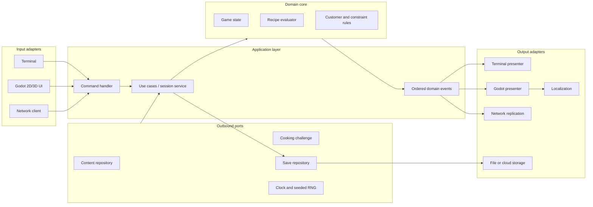
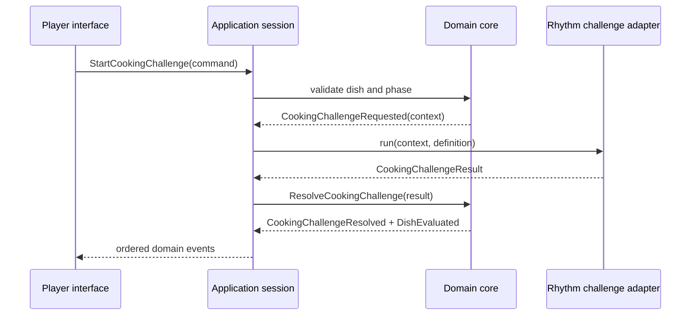

# Neon Kitchen — Technical Architecture and Code Standards

> [!summary] Architectural intent
> Neon Kitchen should preserve its recipe-composition rules while its interface, content, cooking challenges, art direction, language support, and session topology evolve. New content should normally be data. New gameplay should normally be a module behind a stable contract. Terminal, 2D, 3D, localized, and networked versions should be adapters around the same game rules.

## 1. Status and Scope

This document defines the proposed long-term technical foundation and the smaller subset that Phase 1 should actually build.

It is designed to make the following changes local and understandable:

- add an ingredient, recipe pattern, customer, character, or level;
- replace the terminal runner with a Godot user interface;
- add a real-time rhythm-based cooking challenge;
- localize the game into Japanese;
- add server-authoritative multiplayer;
- replace a 2D presentation with a 3D or hand-drawn top-down presentation;
- introduce a focused C# module without rewriting the GDScript game.

This architecture does **not** claim those changes will be cheap. Multiplayer, 3D production, and localization each remain substantial projects. The goal is to avoid preventable rewrites by keeping their likely seams explicit.

### 1.1 Architectural north star

The durable asset is a deterministic, interface-independent game model:

> Given a valid prior state and a valid player command, the core produces a new state and an ordered set of domain events.

Everything that draws, animates, translates, saves, transmits, or collects input belongs outside that core.

### 1.2 Phase 1 constraint

Phase 1 implements only the smallest useful slice:

- typed GDScript domain model;
- application commands and domain events;
- stable content IDs and typed custom `.tres` definitions;
- deterministic recipe evaluation;
- headless or terminal adapter;
- data validation and golden-case tests.

Phase 1 does **not** build speculative multiplayer, 3D, rhythm-game, C#, or localization systems. It creates only the low-cost contracts that keep those routes open.

## 2. Quality Priorities

When priorities conflict, use this order:

1. **Correct and comprehensible game rules**
2. **Fast iteration on the central player experience**
3. **Deterministic, testable behavior**
4. **Local changes with clear ownership**
5. **Data and save compatibility**
6. **Replaceable presentation and infrastructure**
7. **Runtime performance, after measurement**

The architecture is successful when a developer can predict the blast radius of a change before making it.

## 3. Core Principles

### 3.1 Separate policy from presentation

Recipe validity, customer satisfaction, scoring, constraints, and session progression are game policy. Buttons, scenes, animations, audio, terminal text, camera behavior, and network transport are presentation or infrastructure.

The domain core must not depend on:

- `Node`, `Control`, `Node2D`, or `Node3D`;
- scene paths or node paths;
- textures, meshes, animation players, or audio streams;
- translated display text;
- input actions;
- RPC annotations or peer IDs;
- filesystem paths as content identity;
- wall-clock time or unseeded randomness.

### 3.2 Use ports and adapters

A **port** is a small contract describing what the game needs. An **adapter** connects that contract to a particular technology.

Examples:

| Port | Possible adapters |
|---|---|
| `ContentRepository` | Typed `.tres` Resources, generated test definitions, external content import |
| `PlayerInputPort` | Terminal, keyboard/controller UI, touch UI, network client |
| `PresentationPort` | Terminal text, 2D scenes, 3D scenes |
| `CookingChallengePort` | Immediate test result, rhythm minigame, timing minigame |
| `SaveRepository` | In-memory test store, local file, cloud save |
| `LocalizationPort` | Identity test adapter, Godot `TranslationServer` |
| `ClockPort` | Fixed test clock, engine clock, authoritative server clock |
| `RandomPort` | Seeded deterministic generator, recorded replay source |

Ports are owned by the layer that needs them. Infrastructure implements them; infrastructure does not dictate domain design.

### 3.3 Communicate with commands and events

A **command** expresses player or system intent: “select this ingredient” or “submit this dish.” A **domain event** records an accepted fact: “ingredient selected” or “dish evaluated.”

This gives every interface the same interaction language and makes sessions replayable.

Initial command vocabulary:

- `StartSession`
- `PresentCustomer`
- `SelectIngredient`
- `RemoveIngredient`
- `SubmitDish`
- `StartCookingChallenge`
- `ResolveCookingChallenge`

Initial event vocabulary:

- `SessionStarted`
- `CustomerPresented`
- `IngredientSelected`
- `IngredientRemoved`
- `DishSubmitted`
- `CookingChallengeRequested`
- `CookingChallengeResolved`
- `DishEvaluated`
- `CustomerReacted`
- `SessionEnded`

Events report domain facts. They do not contain animation instructions such as “shake the card” or prose such as “Amazing noodles!” A presenter maps facts to the current medium and locale.

### 3.4 Make state transitions deterministic

The same starting state, ordered commands, content version, clock values, and random seed must produce the same result.

Therefore:

- inject time and randomness through ports;
- record the seed and content/schema version with replays and saves;
- never let presentation animation completion silently change game policy;
- process commands in an explicit order;
- assign sequence numbers to accepted commands and events;
- isolate real-time challenge results behind a small result object.

Determinism makes unit tests, debugging, replay, save migration, and future authoritative networking materially easier.

### 3.5 Prefer composition over inheritance

Ingredients, characters, levels, and cooking challenges should combine reusable definitions and capabilities. Avoid deep trees such as:

`Food -> Noodle -> SpicyNoodle -> NeonSpicyNoodle -> FestivalNeonSpicyNoodle`

Prefer:

- an `IngredientDefinition`;
- tags such as `noodle`, `spicy`, and `plant_based`;
- flavor values;
- optional behavior IDs resolved by registered behavior modules;
- presentation references selected by the current visual profile.

Inheritance remains appropriate for stable engine-facing abstractions, not for every content variation.

### 3.6 Use stable identity

Every content record has a unique, namespaced, immutable ID:

- `ingredient.neon_noodles`
- `customer.mina_afterhours`
- `recipe_pattern.comfort_heat`
- `level.night_market_01`
- `challenge.rhythm_wok`

An ID is not a filename, resource path, translated name, node name, or array index. References between content records use IDs.

### 3.7 Keep global state rare

Godot Autoloads are not a general dependency container. A global singleton hides ownership, complicates tests, and creates ordering problems.

Prefer:

- a composition root that constructs dependencies;
- parent scenes that inject dependencies into child scenes;
- local signals upward and method calls downward;
- immutable Resources or plain data objects for definitions;
- an explicit application event stream with a documented lifetime.

An Autoload is acceptable only for a truly process-wide, independently testable facility whose lifetime is the application lifetime. Adding one requires an architecture decision record.

### 3.8 Localize behavior by feature

Code, scenes, tests, and feature-specific assets should be close enough that a feature can be understood without searching the whole repository. A rhythm challenge belongs in its own feature package; it should not scatter scripts throughout recipe evaluation, customer logic, UI, and global managers.

### 3.9 Design seams, not imaginary implementations

Use YAGNI within stable boundaries:

- define a `CookingChallengePort`; do not build five unused minigames;
- use serializable commands and deterministic state; do not build a network stack in Phase 1;
- use localization keys; do not translate unfinished prose;
- keep spatial concepts out of the domain; do not build a 3D abstraction framework.

### 3.10 Use composition without imposing ECS

Neon Kitchen does not use a project-wide Entity Component System. Its primary
architecture is a deterministic domain core with ports/adapters, commands,
events, data-driven definitions, and Godot scene composition.

An ECS is justified only for a bounded subsystem that must process a measured,
large population of similarly structured entities. If that need appears, place
the ECS behind a focused port so recipes, customers, UI, saves, and other
features do not adopt it. Introducing a project-wide ECS requires an ADR.

## 4. System Shape



Dependency direction points inward. The domain does not import application, adapter, or presentation code.

### 4.1 Domain layer

Owns:

- session and dish state;
- ingredients selected for the current dish;
- customer requests and constraints;
- recipe evaluation;
- score and outcome rules;
- domain invariants;
- domain event definitions.

Implementation guidance:

- use typed `RefCounted` classes in GDScript or plain C# objects;
- keep objects independent from the scene tree;
- represent state with explicit data, not UI node state;
- return results or events rather than modifying a presenter;
- reject invalid commands predictably.

### 4.2 Application layer

Owns:

- command validation and routing;
- use-case orchestration;
- session transaction boundaries;
- ordered event publication;
- calls to content, save, clock, random, and challenge ports;
- conversion between serializable DTOs and domain types.

The application layer says **when** a rule runs. The domain says **what the rule means**.

### 4.3 Content layer

Owns definitions, schemas, registries, content packs, and validation.

Initial definition types:

| Definition | Required responsibilities |
|---|---|
| `IngredientDefinition` | ID, localization keys, flavor values, tags, constraint metadata |
| `CustomerDefinition` | ID, name key, request/constraint profile, dialogue keys, presentation ID |
| `CharacterDefinition` | ID, role tags, dialogue set, presentation ID |
| `RecipePatternDefinition` | ID, match conditions, result tags, optional bonuses |
| `LevelDefinition` | ID, encounter/content references, ruleset ID, presentation ID |
| `CookingChallengeDefinition` | ID, provider type, tuning data, result mapping |
| `VisualProfileDefinition` | Semantic presentation IDs mapped to a style or dimension |

Rules:

- definitions contain no live `Node` references;
- player-visible strings are localization keys;
- content references use stable IDs;
- schemas carry an explicit version;
- content loads through a repository port;
- all references and duplicate IDs are validated before play.

### 4.4 Adapter layer

Adapters own technology-specific behavior:

- Godot scene-tree integration;
- terminal parsing and formatting;
- input maps;
- localization calls;
- save encoding and filesystem access;
- RPC nodes and multiplayer peers;
- engine time;
- textures, meshes, animations, and audio.

Adapters may depend on the application and domain contracts. The reverse is forbidden.

### 4.5 Composition root

The boot scene is the one place allowed to know concrete implementations. It:

1. chooses repositories and infrastructure;
2. constructs the application session;
3. creates the desired presentation;
4. injects dependencies;
5. starts the first use case.

A future test, dedicated server, terminal runner, 2D client, and 3D client can each have a different composition root around the same core.

## 5. Godot Scene Architecture

Recommended top-level runtime shape:

```text
Main (composition root)
├── ApplicationHost
├── WorldHost
│   └── CurrentLevelPresentation
├── PresentationHost
│   └── CurrentVisualProfile
├── UIHost
├── ChallengeHost
└── NetworkHost (absent in single-player)
```

Scene rules:

- a reusable scene should run in isolation with injected inputs or documented defaults;
- parents coordinate siblings;
- children signal facts upward;
- parents call child methods downward;
- sibling scenes do not find and mutate one another through absolute node paths;
- UI observes application state/events and issues commands;
- scene nodes do not become the authoritative copy of domain state;
- feature-specific scenes and assets stay with their feature;
- `shared/` contains only genuinely shared code or media.

Use `Resource` for editor-authored, serializable definitions and `RefCounted` for lightweight runtime/domain objects. Do not use `Node` merely to gain lifecycle access.

## 6. Proposed Repository Structure

```text
neon_kitchen/
├── project.godot
├── bootstrap/
│   ├── main.tscn
│   └── composition_root.gd
├── core/
│   ├── domain/
│   │   ├── state/
│   │   ├── rules/
│   │   ├── commands/
│   │   ├── events/
│   │   └── value_objects/
│   ├── application/
│   │   ├── use_cases/
│   │   └── services/
│   └── ports/
├── features/
│   ├── recipe_composition/
│   │   ├── presentation/
│   │   └── assets/
│   └── cooking_challenges/
│       └── rhythm_wok/
│           ├── presentation/
│           ├── assets/
│           └── tests/
├── adapters/
│   ├── terminal/
│   ├── godot_ui/
│   ├── content/
│   ├── localization/
│   ├── persistence/
│   └── networking/
├── content/
│   ├── schemas/
│   ├── base/
│   │   ├── ingredients/
│   │   ├── customers/
│   │   ├── recipe_patterns/
│   │   ├── levels/
│   │   └── localization/
│   └── test_fixtures/
├── shared/
│   ├── errors/
│   └── serialization/
├── tests/
│   ├── unit/
│   ├── content/
│   ├── contract/
│   ├── integration/
│   ├── golden/
│   └── smoke/
├── addons/
└── docs/
    ├── adr/
    └── diagrams/
```

Notes:

- folder and GDScript filenames use `snake_case`;
- C# filenames use `PascalCase` and match their class names;
- Godot-imported assets live under the project;
- non-imported design documents under `docs/` can use `.gdignore`;
- do not create layer folders that remain empty through Phase 1.

## 7. Content Authoring and Versioning

### 7.1 Canonical Phase 1 format

Use typed custom Godot Resources saved as `.tres` files from Phase 1 onward.
This is appropriate because the prototype runs in Godot, even when its adapter
is headless or terminal based.

Benefits:

- typed fields and custom validation behavior;
- Inspector-based authoring when the UI phase begins;
- built-in Godot loading, dependency tracking, and export behavior;
- version-control-friendly text serialization;
- the same authoring format across the prototype and capstone.

Each definition contains an explicit schema version and stable, namespaced
`content_id`. The content repository loads and validates Resources before the
domain consumes them.

Resource paths, Resource UIDs, node names, filenames, and translated names are
not gameplay identity.

### 7.2 Runtime and interchange formats

Treat content Resources as immutable authoring definitions at runtime. The
repository may convert them into immutable runtime snapshots or value objects
when that improves isolation, testing, serialization, or C# interoperability.

JSON may still be appropriate for:

- save files;
- replays and golden snapshots;
- network DTOs;
- external content pipelines;
- debugging and test reports.

If an external JSON content pipeline is added, it imports or generates the
canonical Resource representation. Do not hand-maintain equivalent JSON and
`.tres` copies.

### 7.3 Validation gates

Content validation must catch:

- duplicate or malformed IDs;
- missing referenced IDs;
- invalid schema versions;
- flavor values outside declared ranges;
- impossible or contradictory constraints;
- missing localization keys;
- missing required presentation mappings;
- cycles where the schema forbids them;
- content that cannot be serialized into a save or network DTO.

## 8. Extension Change Map

| Change | Expected additions | Existing code normally changed | Forbidden coupling |
|---|---|---|---|
| New ingredient | definition, locale entries, presentation mapping, validation fixture | registry or generated index only | evaluator `if ingredient == ...` branches |
| New customer/character | definition, request profile, dialogue keys, visuals | content pack/index only | scene path inside customer rules |
| New recipe pattern | pattern definition and golden cases | registry/index; evaluator only if a genuinely new rule primitive is needed | fixed English recipe name in rules |
| New level | level definition, encounters, presentation scene/profile | level registry and composition data | duplicating recipe rules in the level |
| New art style | visual profile and presentation assets/scenes | composition selection | domain changes or new content IDs |
| New cooking minigame | challenge module implementing the challenge port, definition, contract tests | provider registration | minigame directly mutating dish/customer state |
| Japanese localization | Japanese catalog, fonts, layout QA, localized assets if needed | localization manifest | translated strings used as IDs |
| Multiplayer | network adapter, authority policy, DTOs, replication tests | composition root and application boundary | RPCs or peer IDs in domain objects |
| C# subsystem | cohesive module, coarse contract, build/format config, tests | composition root/adapter registration | per-frame chatty cross-language calls |

If a normal content addition requires edits across domain rules, unrelated UI scenes, and save/network code, the seam is failing and should be reviewed before the pattern spreads.

## 9. Stress Test: Real-Time Rhythm Cooking

The recipe-composition core should request a challenge without knowing how it is played.



The context contains serializable facts such as challenge ID, difficulty, allowed duration, seed, and semantic ingredient tags. The result contains a normalized outcome such as:

- score or quality tier;
- timing accuracy;
- duration;
- standardized modifiers;
- challenge version;
- optional diagnostic metadata excluded from game policy.

The rhythm scene owns beat maps, input timing, animation, audio synchronization, and scoring its own performance. It does not own customer satisfaction or final recipe validity.

For multiplayer, the authority policy decides whether the server runs the challenge, validates summarized inputs, or verifies a result. That policy lives at the application/network boundary.

## 10. Stress Test: Japanese Localization

Localization readiness begins before translation:

- all player-visible text uses semantic keys;
- rules compare IDs and enums, never display strings;
- sentences are translated as units rather than assembled from fragments;
- plural-aware calls are used for quantities;
- context distinguishes identical source words with different meanings;
- UI uses containers, wrapping, and flexible sizing;
- font fallback includes required Japanese glyphs;
- visual assets containing text are avoided or use locale remaps;
- pseudolocalization is part of UI verification;
- missing keys are reported as validation failures.

Recommended key shape:

```text
ingredient.neon_noodles.name
ingredient.neon_noodles.description
customer.mina_afterhours.request_intro
feedback.constraint.too_spicy
ui.action.submit_dish
```

Use gettext `.po` catalogs once translation begins. They support contexts and plurals and integrate well with version control and translation tooling. The authoritative source language is still referenced by keys, not used as code identity.

## 11. Stress Test: Multiplayer

Multiplayer naturally fits only if single-player already respects authority and serialization boundaries.

Target model:

1. clients issue serializable commands;
2. the authoritative session validates and orders commands;
3. the domain core applies accepted commands deterministically;
4. the server replicates events or state snapshots;
5. clients present confirmed state and, where appropriate, predict reversible feedback.

Prepare now:

- stable content IDs;
- explicit commands, results, and events;
- deterministic seeds and clocks;
- serializable state without live engine objects;
- sequence numbers and idempotency rules;
- no UI-controlled authoritative values;
- session ownership outside static globals.

Build later:

- RPC nodes and `MultiplayerPeer` selection;
- authentication and trust boundaries;
- lobby and reconnection;
- lag compensation or prediction;
- snapshot frequency and delta format;
- cheating and abuse defenses;
- dedicated-server export and operations.

Godot RPC methods belong on Node-derived networking adapters because Godot’s high-level RPC system is scene-tree based. Domain objects remain unaware of RPCs, node paths, peers, and transfer modes.

## 12. Stress Test: 2D, Hand-Drawn Top-Down, or 3D

The domain describes semantic state:

- customer is waiting;
- station is available;
- ingredient is selected;
- challenge is active;
- dish was accepted.

It does not describe:

- `Vector2` or `Vector3` positions;
- camera transforms;
- sprite frames;
- mesh resources;
- animation names;
- scene paths.

A visual profile maps semantic presentation IDs to scenes and assets. A `PresentationHost` can instantiate a 2D, hand-drawn, or 3D implementation.

Changing dimension still requires new scenes, cameras, animation, navigation, lighting, and assets. It should not require reimplementing recipe evaluation, customer constraints, save semantics, or command handling.

## 13. GDScript and C# Strategy

### 13.1 Default language

Use statically typed GDScript for Phase 1 and as the default for engine-facing gameplay and presentation.

Reasons:

- fastest feedback inside Godot;
- direct alignment with the initial prototype;
- lower cross-language integration cost;
- adequate performance until profiling demonstrates otherwise.

### 13.2 When C# is justified

Introduce C# only for a cohesive module with a recorded reason, such as:

- a required .NET library;
- a substantial algorithmic subsystem whose tooling or profiling favors C#;
- a dedicated server or external service sharing .NET code;
- sustained team expertise and maintenance advantage.

“C# might be faster” is not sufficient without a measured bottleneck.

Before adoption, record:

- target export platforms and current Godot .NET support;
- ownership and build tooling;
- public contract and serialization format;
- how tests run;
- how failures cross the language boundary;
- exit or migration plan.

Keep cross-language calls coarse-grained and use Variant-compatible values, typed DTOs, Resources, or signals at the engine boundary. Avoid per-frame, per-entity chatter between languages.

### 13.3 Contract independence

The domain vocabulary is language-neutral. Commands, events, content schemas, stable IDs, and golden cases define behavior more durably than a particular base class.

If an implementation moves from GDScript to C#, both versions must pass the same contract and golden tests.

## 14. GDScript Standards

Follow the official Godot GDScript style guide, with these project requirements.

### 14.1 Naming

| Element | Convention | Example |
|---|---|---|
| Files and folders | `snake_case` | `recipe_evaluator.gd` |
| Named classes | `PascalCase` | `RecipeEvaluator` |
| Nodes | `PascalCase` | `ChallengeHost` |
| Functions and variables | `snake_case` | `evaluate_dish()` |
| Signals | past-tense `snake_case` | `dish_evaluated` |
| Constants | `CONSTANT_CASE` | `MAX_INGREDIENTS` |
| Enum types | singular `PascalCase` | `QualityTier` |
| Enum values | `CONSTANT_CASE` | `EXCELLENT` |
| Private members | leading underscore | `_content_repository` |

### 14.2 Typing

- type all public parameters and return values;
- type production member variables and non-obvious locals;
- use typed arrays and dictionaries where Godot supports them;
- avoid implicit Variant flow across domain/application boundaries;
- treat unsafe-line and incompatible-type warnings as defects;
- use `class_name` only for stable, broadly useful types, not every script.

### 14.3 File structure

Use the official code order:

1. tool/icon/class documentation;
2. `class_name`;
3. `extends`;
4. signals;
5. enums;
6. constants;
7. static variables;
8. exported variables;
9. public variables;
10. private variables;
11. initialization and lifecycle methods;
12. public methods;
13. private methods;
14. nested classes.

### 14.4 Readability and API design

- target 80 characters and do not exceed 100 without a strong reason;
- use one statement per line;
- document public contracts with `##` documentation comments;
- keep functions focused on one level of abstraction;
- use guard clauses for invalid inputs;
- return an explicit result/error type for expected failures;
- do not use `assert` for recoverable player or content errors;
- replace magic strings with stable IDs, `StringName`, enums, or constants;
- avoid generic managers; name a service for the capability it owns;
- do not use node discovery as dependency injection.

### 14.5 Signals and events

Godot signals are appropriate for scene-local, engine-facing notification. Domain events are plain typed facts controlled by the application session.

Do not create an untyped global event bus. It hides dependencies and turns every feature into a potential consumer of every event.

## 15. C# Standards

Follow the Godot C# style guide and Microsoft C# coding conventions.

### 15.1 Naming and files

- namespaces, classes, methods, properties, and public members use `PascalCase`;
- parameters and local variables use `camelCase`;
- private instance fields use `_camelCase`;
- interfaces begin with `I`;
- C# filenames use `PascalCase` and match the class name;
- namespaces mirror architecture, for example `NeonKitchen.Core.Domain`.

### 15.2 Compiler and formatting

- enable nullable reference types;
- commit `.sln` and `.csproj`;
- commit an `.editorconfig`;
- use analyzers deliberately and pin their versions;
- run `dotnet format --verify-no-changes` in verification when C# exists;
- treat compiler warnings as errors in project-owned code after baseline cleanup;
- ignore generated `.godot/mono` state.

### 15.3 Godot boundary

- Node scripts use the Godot-supported partial-class pattern;
- prefer typed C# events generated from signals over string-based connection calls;
- signal parameters remain Variant-compatible;
- use Godot collections at Variant and engine API boundaries;
- use `System.Collections.Generic` internally when Godot serialization is unnecessary;
- unsubscribe from non-lifecycle-bound events;
- do not expose mutable engine collections directly from domain APIs.

### 15.4 API design

- use immutable records or value objects for commands, events, and results where engine constraints allow;
- use dependency injection through constructors for plain objects and explicit initialization for Nodes;
- make cancellation and async ownership explicit;
- do not block the Godot main thread;
- document public contracts with XML comments;
- avoid exceptions for normal invalid player actions; return explicit results;
- keep domain code independent from `GodotObject` when practical.

## 16. Testing Strategy

```text
                  few
             scene / export smoke
          adapter integration tests
       port contract and replay tests
    domain unit + content validation tests
                 many
```

### 16.1 Domain unit tests

Test every rule without loading a scene:

- ingredient selection invariants;
- customer constraints;
- recipe matching;
- scoring boundaries;
- invalid command behavior;
- deterministic random cases.

### 16.2 Golden cases

Golden cases record human-readable inputs and expected outcomes. The Phase 1 terminal runner and later Godot application must pass the same cases.

Each case includes:

- schema and ruleset version;
- content IDs;
- command sequence;
- random seed and clock inputs;
- expected event sequence;
- expected final state or evaluation.

### 16.3 Content tests

Validate every content pack and localization catalog without launching gameplay. A new ingredient or customer should fail verification before it can create a broken runtime reference.

### 16.4 Port contract tests

Every implementation of a port passes the same behavioral suite. A `.tres`
repository and an in-memory test repository, for example, must resolve IDs and
report missing content consistently.

### 16.5 Integration and smoke tests

Use a smaller number of:

- composition-root startup tests;
- scene instantiation tests;
- input-to-event tests;
- save/load round trips;
- pseudolocalized UI captures;
- simulated multi-peer command-order tests;
- export-startup tests for supported platforms.

### 16.6 Replays as an architecture fitness function

A recorded Phase 1 command sequence should still produce the expected domain event sequence when run through a later interface against the same ruleset and content versions.

If a presentation change breaks a domain replay, the boundary has probably leaked.

## 17. Verification Gates

Before merging a change:

- run `gdformat --check .`;
- run `gdlint .`;
- import the project with Godot in headless mode;
- parse and validate all content;
- reject duplicate and unresolved IDs;
- run domain unit and golden tests headlessly;
- run adapter contract tests affected by the change;
- verify formatting and static analysis;
- check missing localization keys when UI text is involved;
- run scene/export smoke tests when presentation or project configuration changes;
- document intentional schema or replay changes.

When C# exists, also build the .NET solution and verify `dotnet format`.

Pin the compatible GDScript Toolkit version in project-owned development
dependencies. Its linter and formatter supplement Godot; the pinned Godot
editor, headless import, and game tests remain authoritative.

## 18. Definition of Done by Change Type

### 18.1 Content-only addition

- uses a unique stable ID;
- passes schema and reference validation;
- adds required localization keys;
- adds presentation mappings or deliberate placeholders;
- adds at least one focused fixture or golden case;
- requires no unrelated domain or infrastructure edits.

### 18.2 New gameplay module

- has one clear capability and owner;
- implements an existing port or proposes a small new one;
- contains feature-local code, scenes, assets, and tests;
- does not mutate another feature’s internal state;
- declares serialized inputs, results, and failure behavior;
- passes port contract and integration tests;
- documents player-visible behavior.

### 18.3 New adapter

- does not change domain vocabulary merely for technology convenience;
- maps errors explicitly;
- passes the shared port contract suite;
- can be selected by the composition root;
- documents lifecycle and thread/process ownership.

## 19. Architecture Decision Records

Create a short ADR before:

- adding a persistent Autoload;
- introducing C# or another language;
- changing canonical content format;
- creating a cross-feature global service;
- adding a new dependency from the domain;
- changing save, replay, command, or event schemas incompatibly;
- selecting multiplayer authority and replication models;
- replacing the Godot version or target platform matrix.

An ADR contains context, decision, alternatives, consequences, and status. It can be superseded; it should not be silently rewritten.

## 20. Phase 1 Architecture Slice

Build now:

```text
Terminal input
    -> typed application command
    -> session service
    -> deterministic domain rules
    -> ordered domain events
    -> terminal presenter

Typed versioned `.tres` Resources
    -> validating content repository
    -> typed definitions
```

Required Phase 1 seams:

- stable IDs;
- localization keys, even if English is the only catalog;
- explicit commands and events;
- injected seed/random source;
- typed content repository;
- recipe evaluator independent from Node and UI;
- golden command/event cases;
- one composition root for the headless runner.

Deferred implementations:

- full `TranslationServer` adapter and Japanese catalog;
- visual profile system;
- cooking challenge scenes;
- persistence beyond test fixtures;
- networking;
- C#;
- 2D/3D presentation packages.

This is the minimum architecture that protects future routes without turning Phase 1 into infrastructure development.

## 21. Open Decisions

| ID | Decision needed | When |
|---|---|---|
| ARCH-Q01 | Pin the Godot 4.x version and export targets. | Before repository bootstrap |
| ARCH-Q02 | Choose the headless GDScript test framework and CI command. | Before first test harness |
| ARCH-Q03 | Lock initial command, event, and evaluator result fields. | Before evaluator implementation |
| ARCH-Q04 | Define content-pack and schema-version migration rules. | Before the second schema version |
| ARCH-Q05 | Decide whether an external JSON import/export pipeline is needed. | When external tooling or network interchange requires it |
| ARCH-Q06 | Define measurable criteria for approving a C# module. | Before first C# proposal |
| ARCH-Q07 | Choose client/server authority and transport requirements. | Before multiplayer implementation |

## 22. Official References

Godot:

- [GDScript style guide](https://docs.godotengine.org/en/stable/tutorials/scripting/gdscript/gdscript_styleguide.html)
- [Static typing in GDScript](https://docs.godotengine.org/en/stable/tutorials/scripting/gdscript/static_typing.html)
- [Project organization](https://docs.godotengine.org/en/stable/tutorials/best_practices/project_organization.html)
- [Scene organization](https://docs.godotengine.org/en/stable/tutorials/best_practices/scene_organization.html)
- [Autoloads versus regular nodes](https://docs.godotengine.org/en/stable/tutorials/best_practices/autoloads_versus_regular_nodes.html)
- [When and how to avoid using nodes for everything](https://docs.godotengine.org/en/stable/getting_started/workflow/best_practices/node_alternatives.html)
- [Resources](https://docs.godotengine.org/en/4.5/tutorials/scripting/resources.html)
- [ResourceSaver](https://docs.godotengine.org/en/stable/classes/class_resourcesaver.html)
- [Why Godot is not an ECS-based engine](https://godotengine.org/article/why-isnt-godot-ecs-based-game-engine/)
- [Using signals](https://docs.godotengine.org/en/stable/getting_started/step_by_step/signals.html)
- [C# signals](https://docs.godotengine.org/en/stable/tutorials/scripting/c_sharp/c_sharp_signals.html)
- [Internationalizing games](https://docs.godotengine.org/en/4.4/tutorials/i18n/internationalizing_games.html)
- [Localization using gettext](https://docs.godotengine.org/en/latest/tutorials/i18n/localization_using_gettext.html)
- [Pseudolocalization](https://docs.godotengine.org/en/stable/tutorials/i18n/pseudolocalization.html)
- [High-level multiplayer](https://docs.godotengine.org/en/stable/tutorials/networking/high_level_multiplayer.html)
- [C# basics](https://docs.godotengine.org/en/stable/tutorials/scripting/c_sharp/c_sharp_basics.html)
- [C# API differences](https://docs.godotengine.org/en/stable/tutorials/scripting/c_sharp/c_sharp_differences.html)
- [C# style guide](https://docs.godotengine.org/en/stable/tutorials/scripting/c_sharp/c_sharp_style_guide.html)
- [C# collections](https://docs.godotengine.org/en/stable/tutorials/scripting/c_sharp/c_sharp_collections.html)
- [GDScript warning system](https://docs.godotengine.org/en/stable/tutorials/scripting/gdscript/warning_system.html)
- [Command-line reference](https://docs.godotengine.org/en/stable/tutorials/editor/command_line_tutorial.html)

Community tooling:

- [GDScript Toolkit (`gdlint`, `gdformat`, `gdradon`)](https://github.com/Scony/godot-gdscript-toolkit)

Microsoft:

- [C# coding conventions](https://learn.microsoft.com/en-us/dotnet/csharp/fundamentals/coding-style/coding-conventions)
- [`dotnet format`](https://learn.microsoft.com/en-us/dotnet/core/tools/dotnet-format)

## 23. Approval Record

| Version | Date | Status | Notes |
|---|---|---|---|
| 0.1 | 2026-07-30 | Proposed | Initial long-term foundation and Phase 1 slice |
| 0.2 | 2026-07-30 | Proposed | Adopted `.tres`-first content, scoped ECS policy, coding-agent structure, and initial GDScript quality gates |
